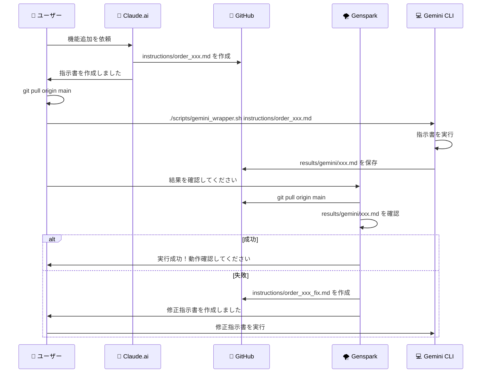
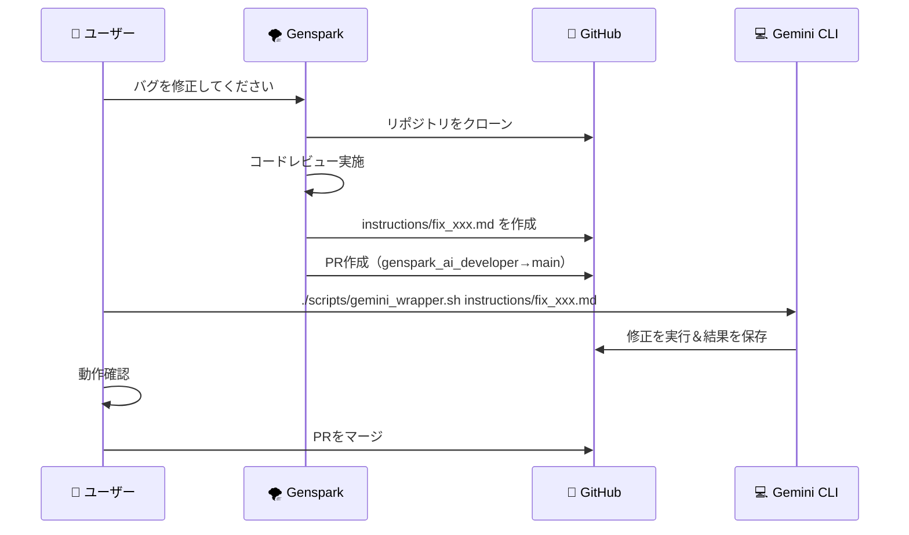

# 🏢 Virtual Company - WEB版AIチャット連携システム

**作成日**: 2026-01-31  
**目的**: WEB版AIチャット（Claude.ai、ChatGPT、Genspark）を活用した協業システムの最適化

---

## 🎯 システム概要

### 現在の仕組み

```
┌─────────────────────────────────────────────────────────┐
│           🌐 WEB版AIチャット（GitHub連携）              │
├─────────────────────────────────────────────────────────┤
│  Claude.ai  │  ChatGPT    │  Genspark   │  Gemini      │
│  (GitHub    │  (GitHub    │  (GitHub    │  (ローカル   │
│   MCP)      │   Actions)  │   連携)     │   CLI)       │
└─────────────────────────────────────────────────────────┘
           ↓                ↓               ↓
┌─────────────────────────────────────────────────────────┐
│              📁 GitHub リポジトリ                        │
│         garyohosu/virtual-company                       │
├─────────────────────────────────────────────────────────┤
│  instructions/    ← 指示書を保存                        │
│  results/         ← 実行結果を保存                      │
│  Employees/       ← AI従業員の記憶                      │
└─────────────────────────────────────────────────────────┘
           ↓
┌─────────────────────────────────────────────────────────┐
│          💻 ローカルPC（ユーザー環境）                   │
│          Gemini CLI で実行                              │
└─────────────────────────────────────────────────────────┘
```

---

## 📋 各AIの役割分担

### 1. **Claude.ai** (指示書作成者)

**役割**: 指示書の作成とGitHubへの保存

**使用ツール**: 
- GitHub MCP（Model Context Protocol）
- `github:create_or_update_file`
- `github:search_repositories`

**作業フロー**:
```
1. ユーザーからの要望を受ける
2. 指示書を作成（Markdown形式）
3. GitHub MCPで instructions/ に保存
4. CLAUDE_MEMORY.md に記録
5. ユーザーに報告
```

**制約事項**:
- ❌ ローカルPCが見えない
- ❌ ファイルの実行はできない
- ✅ GitHubの読み書きが可能
- ✅ 永続記憶（CLAUDE_MEMORY.md）が使える

---

### 2. **ChatGPT** (GitHub Actions連携)

**役割**: GitHub Actionsを通じた自動化

**使用ツール**:
- GitHub Actions
- Workflow dispatch
- Issue/PR コメント

**作業フロー**:
```
1. GitHub Actionsのワークフローを作成
2. PRのレビューとコメント
3. CI/CDパイプラインの管理
4. テスト結果の確認
```

**制約事項**:
- ⚠️ GitHub MCP非対応（執筆時点）
- ✅ GitHub Actionsとの連携が可能
- ✅ PR/Issueコメントが可能

---

### 3. **Genspark** (外部協力者・風車の弥七)

**役割**: 指示書の作成、コードレビュー、修正提案

**使用ツール**:
- GitHub連携（読み書き可能）
- サンドボックス環境
- Read/Write/Edit/Bash ツール

**作業フロー**:
```
1. リポジトリをクローン
2. コードレビュー実施
3. 指示書を作成
4. ブランチで作業
5. PRを作成
6. 実行結果を確認（results/）
7. 必要に応じて修正指示書を作成
```

**制約事項**:
- ❌ main ブランチへの直接push禁止
- ❌ 仕様・方針の確定権限なし
- ✅ 大量の指示書・資料作成が得意
- ✅ サンドボックスで実行可能

---

### 4. **Gemini CLI** (実行者)

**役割**: ローカルPCで指示書を実行

**使用ツール**:
- `gemini --yolo` コマンド
- Bash/Python/PHPスクリプト実行
- ファイルシステムアクセス

**作業フロー**:
```
1. git pull でリポジトリ更新
2. instructions/ をスキャン
3. 新しい指示書を検出
4. 指示書を実行
5. 結果を results/gemini/ に保存
6. Git にコミット＆プッシュ
```

**制約事項**:
- ⚠️ ローカル環境でのみ動作
- ✅ 実際のファイル操作が可能
- ✅ 実際のコマンド実行が可能

---

## 🔄 協業ワークフロー

### パターン1: 新機能開発



---

### パターン2: バグ修正



---

## 🛠️ 改善提案

### 改善1: WEB版AI専用の指示書テンプレート

**目的**: WEB版AIでも実行しやすい指示書を作成

#### テンプレート: `instructions/TEMPLATE_WEB_AI.md`

```markdown
# 🎯 [機能名] - WEB版AI用指示書

**作成日**: YYYY-MM-DD  
**対象AI**: Claude.ai / ChatGPT / Genspark  
**実行環境**: WEB版AIチャット  

---

## 📋 実行内容

[何を実行するかを明確に記載]

---

## 🔧 GitHub操作

### 作成するファイル

| ファイルパス | 内容 |
|-------------|------|
| `path/to/file1.php` | [ファイル1の内容] |
| `path/to/file2.js` | [ファイル2の内容] |

### ファイル1: `path/to/file1.php`

\`\`\`php
<?php
// コード内容
?>
\`\`\`

### ファイル2: `path/to/file2.js`

\`\`\`javascript
// コード内容
\`\`\`

---

## ✅ 実行手順（WEB版AI用）

### Step 1: GitHub MCPでファイルを作成

```
github:create_or_update_file を使用:
- owner: garyohosu
- repo: magic-box-ai
- path: path/to/file1.php
- content: [上記のコード]
- message: "feat: Add file1"
- branch: genspark_ai_developer
```

### Step 2: PRを作成

```
github:create_pull_request を使用:
- owner: garyohosu
- repo: magic-box-ai
- title: "feat: [機能名]"
- body: [PR説明]
- head: genspark_ai_developer
- base: main
```

---

## 📝 ローカル実行用コマンド（Gemini CLI用）

\`\`\`bash
cd ~/garyohosu/magic-box-ai
git pull origin main

# 実行コマンド
[実際に実行するコマンド]
\`\`\`

---

## ✅ 確認項目

- [ ] ファイルが正しく作成されている
- [ ] 構文エラーがない
- [ ] PRが作成されている
- [ ] ブランチが正しい（genspark_ai_developer）

---

**Status**: 準備完了  
**Current Actor**: [AI名]  
**Next Actor**: User（確認）
```

---

### 改善2: WEB版AI用のヘルパー関数

#### ファイル: `scripts/web_ai_helper.md`

```markdown
# 🌐 WEB版AI用ヘルパー

## GitHub MCP 使用例

### ファイルの作成・更新

\`\`\`
github:create_or_update_file
{
  "owner": "garyohosu",
  "repo": "virtual-company",
  "path": "instructions/order_xxx.md",
  "content": "ファイル内容",
  "message": "feat: Add instruction",
  "branch": "main"
}
\`\`\`

### PR作成

\`\`\`
github:create_pull_request
{
  "owner": "garyohosu",
  "repo": "virtual-company",
  "title": "feat: Add new feature",
  "body": "説明",
  "head": "genspark_ai_developer",
  "base": "main"
}
\`\`\`

### ファイル検索

\`\`\`
github:search_repositories
{
  "query": "repo:garyohosu/virtual-company filename:*.md"
}
\`\`\`
```

---

### 改善3: 実行結果の自動フィードバックシステム

#### ファイル: `scripts/check_and_feedback.sh`

```bash
#!/bin/bash
# 実行結果を確認してWEB版AIにフィードバック

RESULTS_DIR="results/gemini"
LATEST_RESULT=$(ls -t "$RESULTS_DIR"/*.md 2>/dev/null | head -1)

if [ -z "$LATEST_RESULT" ]; then
    echo "📊 実行結果が見つかりません"
    exit 0
fi

echo "📊 最新の実行結果: $LATEST_RESULT"
echo ""

# エラーチェック
if grep -q "❌ FAILED" "$LATEST_RESULT"; then
    echo "🚨 エラーを検出しました！"
    echo ""
    
    # エラー内容を抽出
    ERROR_CONTENT=$(sed -n '/## 🚨 エラー出力/,/## 🎯 次のアクション/p' "$LATEST_RESULT")
    
    # フィードバック用のIssueを作成（GitHub CLI使用）
    ISSUE_TITLE="❌ Execution Failed: $(basename $LATEST_RESULT .md)"
    ISSUE_BODY="## 実行結果

実行に失敗しました。

### エラー内容

\`\`\`
$ERROR_CONTENT
\`\`\`

### 実行ファイル
$LATEST_RESULT

### 対応が必要な項目
- [ ] エラー原因の特定
- [ ] 修正指示書の作成
- [ ] 再実行

**担当AI**: Claude.ai / Genspark"

    # GitHub Issueを作成
    gh issue create \
        --title "$ISSUE_TITLE" \
        --body "$ISSUE_BODY" \
        --label "bug,execution-failed" \
        --assignee garyohosu
    
    echo "✅ GitHub Issueを作成しました"
    
else
    echo "✅ 実行は成功しました"
    
    # 成功をGitHub Discussionsに投稿（オプション）
    # gh discussion create ...
fi
```

---

### 改善4: AIごとの作業ログ

#### ディレクトリ構造

```
results/
├── claude/                      # Claude.ai の作業ログ
│   ├── 2026-01-31_created_instruction_ui.md
│   └── 2026-01-31_updated_memory.md
├── chatgpt/                     # ChatGPT の作業ログ
│   └── 2026-01-31_reviewed_pr.md
├── genspark/                    # Genspark の作業ログ
│   ├── 2026-01-31_code_review.md
│   └── 2026-01-31_created_instructions.md
└── gemini/                      # Gemini CLI の実行ログ
    └── 2026-01-31_executed_xxx.md
```

#### 各AIが作業完了時にログを作成

**Claude.ai の場合**:
```markdown
# 📝 Claude.ai 作業ログ

## 作業日時
2026-01-31 12:34:56

## 実行内容
- 指示書を作成: `instructions/order_xxx.md`
- CLAUDE_MEMORY.md を更新

## GitHub操作
- ✅ ファイル作成: instructions/order_xxx.md
- ✅ ファイル更新: instructions/CLAUDE_MEMORY.md

## 次のアクション
ユーザーがGemini CLIで実行してください。

---
**作成者**: Claude.ai
```

---

## 🎯 実装手順

### Step 1: テンプレートファイルを作成

```bash
cd ~/garyohosu/virtual-company

# WEB版AI用テンプレート
cat > instructions/TEMPLATE_WEB_AI.md << 'EOF'
[上記のテンプレート内容]
EOF

# ヘルパーファイル
cat > scripts/web_ai_helper.md << 'EOF'
[上記のヘルパー内容]
EOF

# フィードバックスクリプト
cat > scripts/check_and_feedback.sh << 'EOF'
[上記のスクリプト内容]
EOF

chmod +x scripts/check_and_feedback.sh
```

### Step 2: 各AIのREADMEを作成

```bash
# Claude.ai 用README
cat > results/claude/README.md << 'EOF'
# Claude.ai 作業ログ

このフォルダにはClaude.aiの作業ログが保存されます。

## ログ形式
- ファイル名: `YYYY-MM-DD_作業内容.md`
- 内容: 実行した操作、作成したファイル、次のアクション
EOF

# 他のAI用READMEも同様に作成
```

### Step 3: GitHubにコミット

```bash
git add instructions/TEMPLATE_WEB_AI.md
git add scripts/web_ai_helper.md
git add scripts/check_and_feedback.sh
git add results/*/README.md

git commit -m "feat: Add WEB AI collaboration system

- Add WEB AI instruction template
- Add GitHub MCP helper guide
- Add automatic feedback system
- Add work log structure for each AI"

git push origin genspark_ai_developer
```

---

## 📊 使用例

### 例1: Claude.aiで指示書を作成

**ユーザー**: 「保存ボタンに確認ダイアログを追加してください」

**Claude.ai**:
1. `instructions/TEMPLATE_WEB_AI.md` を参考に指示書を作成
2. GitHub MCPで `instructions/order_add_confirmation_dialog.md` を作成
3. `results/claude/2026-01-31_created_confirmation_instruction.md` を作成
4. ユーザーに「指示書を作成しました。Gemini CLIで実行してください」と報告

---

### 例2: Gensparkでコードレビュー

**ユーザー**: 「コードレビューしてください」

**Genspark**:
1. リポジトリをクローン
2. コードレビュー実施
3. `CODE_REVIEW_REPORT_YYYYMMDD.md` を作成
4. 問題があれば `instructions/fix_xxx.md` を作成
5. `results/genspark/2026-01-31_code_review.md` を作成
6. PRを作成してユーザーに報告

---

### 例3: Gemini CLIで実行

**ユーザー**:
```bash
cd ~/garyohosu/virtual-company
git pull origin main
./scripts/gemini_wrapper.sh instructions/order_add_confirmation_dialog.md
```

**Gemini CLI**:
1. 指示書を実行
2. `results/gemini/2026-01-31_xxx.md` を作成
3. Git にコミット＆プッシュ

**自動フィードバック**:
```bash
./scripts/check_and_feedback.sh
# → 成功 or 失敗をGitHub Issueで報告
```

---

## 🎉 期待される効果

### 1. **協業の効率化**
- 各AIの役割が明確
- 指示書の形式が統一
- 実行結果のフィードバックが自動化

### 2. **トレーサビリティの向上**
- すべての作業がGitHubに記録
- AI ごとの作業ログが残る
- 問題発生時の原因追跡が容易

### 3. **自動化の促進**
- WEB版AIでもGitHub操作が容易
- 実行結果の自動フィードバック
- エラー検出→Issue作成が自動化

### 4. **スケーラビリティ**
- 新しいAIの追加が容易
- 指示書のテンプレートが用意されている
- 作業ログの形式が統一

---

## 📝 まとめ

このシステムにより、WEB版AIチャット（Claude.ai、ChatGPT、Genspark）とローカルのGemini CLIが協力して、効率的に開発を進めることができます。

**重要なポイント**:
1. 各AIの役割を明確に分担
2. GitHubを中心とした情報共有
3. 実行結果の自動保存とフィードバック
4. テンプレートとヘルパーで作業を標準化

---

**このファイルを実行**:
```bash
cd ~/garyohosu/virtual-company
git pull origin main
gemini --yolo instructions/order_web_ai_collaboration_20260131.md
```

---

**Status**: 準備完了  
**Priority**: 🟡 中  
**Current Actor**: User  
**Next Actor**: 各AI（Claude、Genspark、Gemini）  
**Created At**: 2026-01-31
